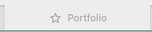

# Build a Portfolio Website

## Overview
Build your own resume and work sample portfolio using this project template. With this template, simply edit 
placeholder text, add relevant images, and deploy. You'll be able to share a new portfolio site in a few short hours.
The site was designed using Safari and is responsive. It was designed for a large web screen.


## Prerequisites
This project is built using:
- [TypeScript](https://www.typescriptlang.org)
- [React.js](https://react.dev)
- [Bootstrap](https://getbootstrap.com)
- [Bootswatch](https://bootswatch.com)
- [React-Boostrap](https://react-bootstrap.netlify.app)
- [React-Router](https://reactrouter.com/en/main)

You do not need formal knowledge of these technologies, but it would be helpful to understand
TypeScript strings, arrays, and objects, as you will be editing TypeScript objects.

The instructions assume some familiarity with software engineering, the command line, git, and repositories. 
If you are unfamiliar with these concepts, it should be possible to create and deploy the site, but it 
will be more challenging and take longer.

If you find a bug or have issues with setup, submit an issue on the repository. You can also submit pull requests with
bug fixes and features.

## Objectives
Use this project to:
- Create your own portfolio to share with potential employers. This includes About, Resume, Samples, and Contact pages.
- Deploy and host your site on Netlify (or other hosting site of your choice).
- Optional: Use a custom domain.

## Estimated Time: 
Setting up and customizing your site will take approximately 1-2 hours if your content is ready to publish. 
If you are using a custom domain, it may take 24 hours to fully propagate across the internet.

## Project Set Up

### Download the project
- [Download and install Node.js and npm](https://docs.npmjs.com/downloading-and-installing-node-js-and-npm)
- [Clone](https://docs.github.com/en/repositories/creating-and-managing-repositories/cloning-a-repository) this repository

### Install Required Packages
Navigate to the repository in your command line.

#### Install Bootstrap
```
npm i bootstrap node-sass --exac
```
#### Install React-Bootstrap
```
npm install react-bootstrap
```
#### Install Bootswatch

```
npm install bootswatch
```
#### Install React-Router
```
npm i react-router
npm i react-router-dom
```
#### Install Fontawesome
```
npm i --save @fortawesome/fontawesome-svg-core
npm i --save @fortawesome/free-solid-svg-icons
npm i --save @fortawesome/free-regular-svg-icons
npm i --save @fortawesome/free-brands-svg-icons
npm i --save @fortawesome/react-fontawesome@latest
```
### View the site locally
- In the project directory, run `npm start`.
- Open [http://localhost:3000](http://localhost:3000) to view it in the browser.
- Changes made to the repository will update automatically.

## Customize your site

### Update the name and image displayed in the browser.


#### Update the title text

In `public/index.html`, find the `<title>` tags and update the text.
```html
    <title>Portfolio (put desired title here)</title>
```

#### Update your site logo
Replace `favicon.ico` with your desired logo in a .ico format.

### Add images
All images should be stored in `public/images/`. 
Company logos can be separated into the `public/images/logos` directory.

### Update the theme
This site uses Bootswatch's Minty theme. Change the theme by replacing `minty` with your desired theme name.
[theme](https://bootswatch.com).

In `index.tsx` change "minty" to your desired theme.
```typescript jsx
import 'bootswatch/dist/minty/bootstrap.min.css';
```


- ## Deploy
- Run `npm run build` when you are ready to deploy.

