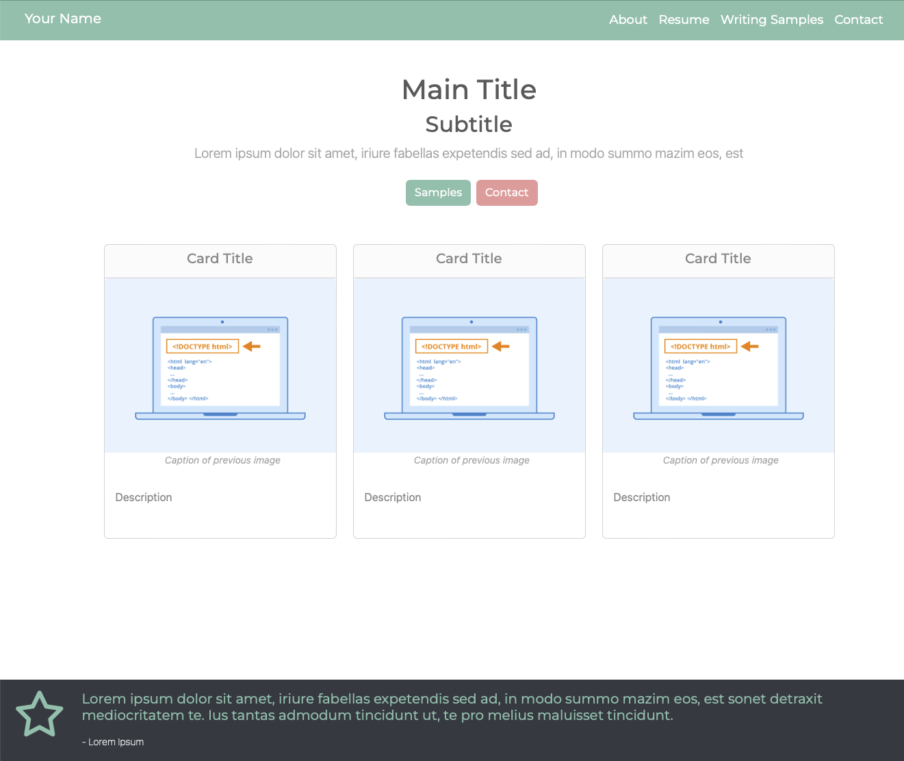

# Build a Portfolio Website

## Overview
Build your own resume and work sample portfolio using this project template. 

With this template, simply edit 
placeholder text, add relevant images, and deploy. You'll be able to share a new portfolio site in a few hours.
The site is designed to be responsive, but is best viewed on a large screen. It was tested on Safari.

View the deployed template site at https://your-portfolio-template.netlify.app. 



## Prerequisites
This project is built using:
- [TypeScript](https://www.typescriptlang.org)
- [React.js](https://react.dev)
- [Bootstrap](https://getbootstrap.com)
- [Bootswatch](https://bootswatch.com)
- [React-Boostrap](https://react-bootstrap.netlify.app)
- [React-Router](https://reactrouter.com/en/main)

You do not need formal knowledge of these technologies, but it would be helpful to understand
TypeScript strings, arrays, and objects, as you will be editing TypeScript objects.

The instructions assume some familiarity with software engineering, the command line, git, and repositories. 
If you are unfamiliar with these concepts, it should be possible to create and deploy the site, but it 
will be more challenging and take longer.

If you find a bug or have issues with setup, submit an issue on the repository. You can also submit pull requests with
bug fixes and features.

## Objectives
Use this project to:
- Create your own portfolio to share with potential employers. This includes About, Resume, Samples, and Contact pages.
- Deploy and host your site on Netlify (or other hosting site of your choice).
- Optional: Use a custom domain.

## Estimated Time: 
Setting up and customizing your site will take approximately 1-2 hours if your content is ready to publish. 
If you are using a custom domain, it may take 24 hours to fully propagate across the internet.

## Project Set Up

### Download the project
- [Download and install Node.js and npm](https://docs.npmjs.com/downloading-and-installing-node-js-and-npm)
- [Clone](https://docs.github.com/en/repositories/creating-and-managing-repositories/cloning-a-repository) this repository

### Install Required Packages
Navigate to the repository in your command line.

#### Install Bootstrap
```
npm i bootstrap node-sass --exac
```
#### Install React-Bootstrap
```
npm install react-bootstrap
```
#### Install Bootswatch

```
npm install bootswatch
```
#### Install React-Router
```
npm i react-router
npm i react-router-dom
```
#### Install Fontawesome
```
npm i --save @fortawesome/fontawesome-svg-core
npm i --save @fortawesome/free-solid-svg-icons
npm i --save @fortawesome/free-regular-svg-icons
npm i --save @fortawesome/free-brands-svg-icons
npm i --save @fortawesome/react-fontawesome@latest
```
### View the site locally
- In the project directory, run `npm start`.
- Open [http://localhost:3000](http://localhost:3000) to view it in the browser.
- Changes made to the repository will update automatically.

## Customize your site

### Update the name and image displayed in the browser.


#### Update the title text

In `public/index.html`, find the `<title>` tags and update the text.
```html
    <title>Portfolio (put desired title here)</title>
```

#### Update your site logo
Consider using a tool like [favicon.io](https://favicon.io) to create or generate your icon.
Replace the following files in the `public/` directory with your versions of the same image.
- public/favicon.ico 
- public/logo192.png (192 x 192 pixels)
- public/logo512.png (512 x 512 pixels)

### Add content
#### Content changes
- The `src/data/` directory contains a subdirectory for each page. Component data is stored in each file.
- Each page has instructions for how to update, add, and remove content as well as design considerations.
- Data is usually stored in a TypeScript object or in an array of TypeScript objects. Replace the template data
with your own content in each file. 
- Images should be added to the `public/images/` directory. Update the file paths (stored as strings) to the relevant object.
- Company logos can be separated into the `public/images/logos` directory.
- Icons can be found on [Fontawesome](https://fontawesome.com/search).

#### More advanced changes
To change an object's properties, edit the corresponding model in the `src/models/` directory.
To remove a component from a page, remove it from relevant page or component in `src/pages/`.

### Update the theme
This site uses Bootswatch's Minty theme. Change the theme by replacing `minty` with your desired theme name.
[theme](https://bootswatch.com).

In `index.tsx` change "minty" to your desired theme.
```typescript jsx
import 'bootswatch/dist/minty/bootstrap.min.css';
```

### Commit Changes
Add, commit, and push your changes to GitHub.

## Deploy
This guide uses Netlify and GitHub to deploy, but you can use any hosting platform you choose. 

- Login or create an account on [Netlify](https://www.netlify.com)
- Click on "Add new site" -> Import an existing project. 
- Select "Deploy with GitHub" and select your repository. You may need to Configure Netlify on GitHub find and select it.
- If you do not own a domain, select a site name to make it easier to find. Ex. your-name-portfolio. It will need to be unique.
- Select `main` under branch to deploy if not already selected.
- Click `Deploy`. If continuous deployment is set up, each push to the main branch should automatically deploy if there are no build errors.
- View your site at the URL you selected. It may take a few minutes.

#### Advanced Deployment
If you want to deploy to a custom domain, it's easiest if you buy the domain from the hosting site if offered.
If you already own a domain, search for instructions on connecting Netlify (or your hosting platform) and 
the domain site. (Namecheap, Go Daddy, etc.)

## Issues and Contributions
If you experienced any issues with this guide or the template, create an issue on this repository. 
Pull requests with bug fixes are also appreciated. 


